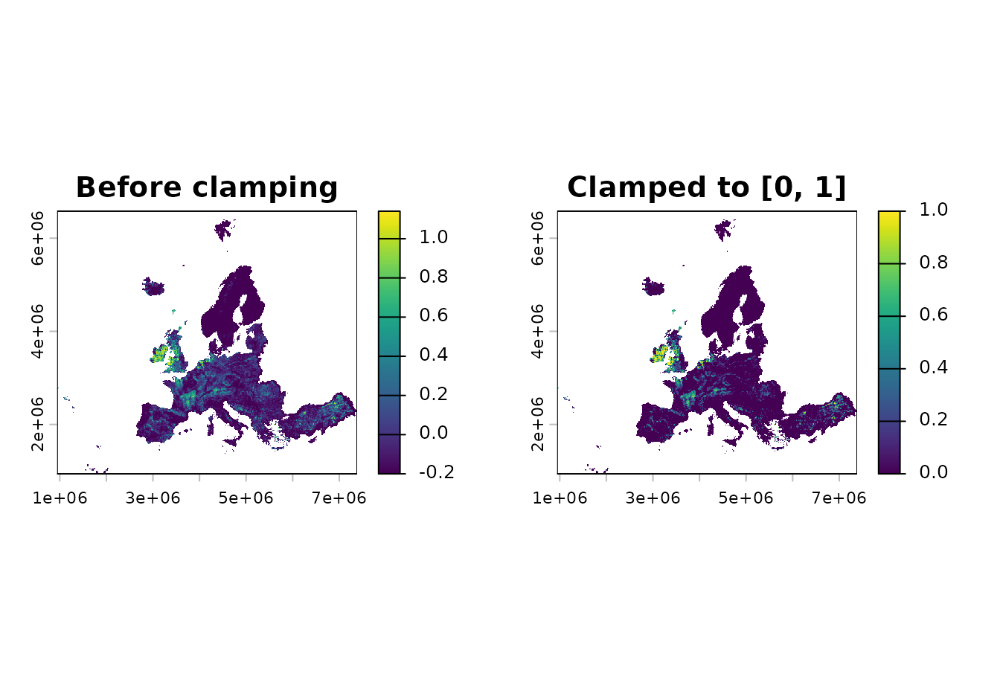
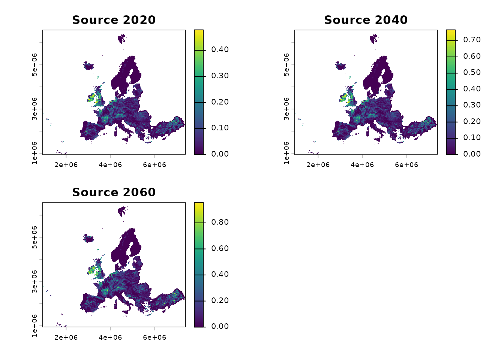
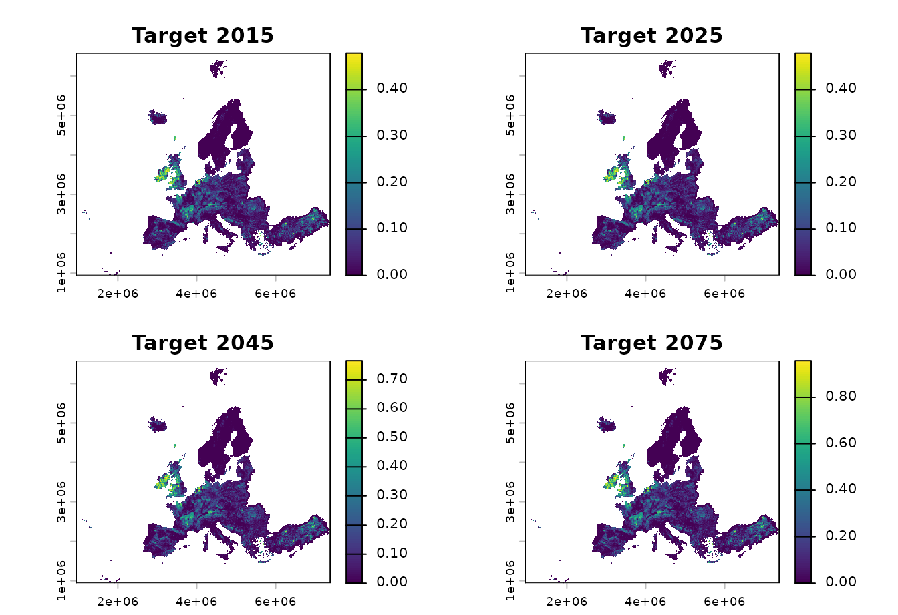
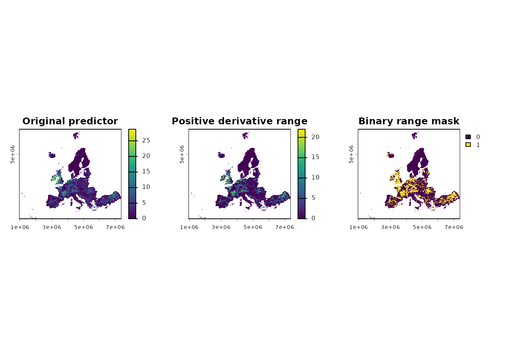

# General helper functions

This article demonstrates the general helper functions in
`ibis.insights`. These helpers are useful for preparing suitability
layers, aligning temporal inputs, and interpreting derivative predictor
terms.

``` r

library(ibis.insights)
library(terra)
library(stars)
```

## Example data

The examples use the small rasters shipped with the package. The
land-use layer is converted from an integer fraction in `[0, 10000]` to
a proportion in `[0, 1]`.

``` r

range <- terra::rast(system.file(
  "extdata/example_range.tif",
  package = "ibis.insights",
  mustWork = TRUE
))

grassland <- terra::rast(system.file(
  "extdata/Grassland.tif",
  package = "ibis.insights",
  mustWork = TRUE
)) / 10000
names(grassland) <- "grassland"

dem <- terra::rast(system.file(
  "extdata/DEM.tif",
  package = "ibis.insights",
  mustWork = TRUE
))
names(dem) <- "scaled_dem"
```

## Clamp values with `st_clamp()`

Use
[`st_clamp()`](https://iiasa.github.io/ibis.insights/reference/st_clamp.md)
when a suitability or fractional layer may contain values outside its
valid range. This can happen after rescaling, combining predictors, or
applying a model transformation. Values below the lower bound are set to
the lower bound; values above the upper bound are set to the upper
bound.

``` r

raw_suitability <- (grassland * 1.4) - 0.2
names(raw_suitability) <- "raw_suitability"

clamped_suitability <- st_clamp(
  raw_suitability,
  lower = 0,
  upper = 1
)
names(clamped_suitability) <- "clamped_suitability"
```

``` r

terra::global(c(raw_suitability, clamped_suitability), "range", na.rm = TRUE)
#>                      min     max
#> raw_suitability     -0.2 1.14064
#> clamped_suitability  0.0 1.00000
```

``` r

op <- par(mfrow = c(1, 2), mar = c(2, 2, 3, 4))
plot(raw_suitability, main = "Before clamping")
plot(clamped_suitability, main = "Clamped to [0, 1]")
```



``` r

par(op)
```

The same function also works with `stars` objects.

``` r

clamped_stars <- st_clamp(
  stars::st_as_stars(raw_suitability),
  lower = 0,
  upper = 1
)
clamped_stars
#> stars object with 2 dimensions and 1 attribute
#> attribute(s):
#>                  Min. 1st Qu. Median       Mean 3rd Qu. Max.    NAs
#> raw_suitability     0       0      0 0.05840846       0    1 297511
#> dimension(s):
#>   from  to  offset  delta                        refsys x/y
#> x    1 644  943761  10000 PROJCRS["unknown",\n    BA... [x]
#> y    1 564 6579903 -10000 PROJCRS["unknown",\n    BA... [y]
```

## Align temporal layers with `align_temporal()`

Use
[`align_temporal()`](https://iiasa.github.io/ibis.insights/reference/align_temporal.md)
when two temporal raster objects use different time steps. For each
target year, the function selects the most recent source layer whose
year is less than or equal to the target year. If the target is earlier
than the first source year, the first source layer is used.

Here a coarse source time series is aligned to more frequent target
years.

``` r

source_lu <- c(grassland * 0.5, grassland * 0.8, grassland)
names(source_lu) <- c("grassland_2020", "grassland_2040", "grassland_2060")
terra::time(source_lu) <- as.Date(c(
  "2020-01-01",
  "2040-01-01",
  "2060-01-01"
))

target_template <- c(range, range, range, range)
names(target_template) <- c("target_2015", "target_2025", "target_2045", "target_2075")
terra::time(target_template) <- as.Date(c(
  "2015-01-01",
  "2025-01-01",
  "2045-01-01",
  "2075-01-01"
))

aligned_lu <- align_temporal(source_lu, target_template)
```

``` r

data.frame(
  target_year = as.integer(terra::time(aligned_lu)),
  selected_source_layer = names(aligned_lu)
)
#>   target_year selected_source_layer
#> 1        2015        grassland_2020
#> 2        2025        grassland_2020
#> 3        2045        grassland_2040
#> 4        2075        grassland_2060
```

``` r

plot(
  source_lu,
  main = c("Source 2020", "Source 2040", "Source 2060")
)
```



``` r

plot(
  aligned_lu,
  main = c("Target 2015", "Target 2025", "Target 2045", "Target 2075")
)
```



## Recreate derivative predictor ranges with `create_derivate_range()`

[`create_derivate_range()`](https://iiasa.github.io/ibis.insights/reference/create_derivate_range.md)
is a specialized helper for reconstructing the range of an original
predictor that is represented by derivative model terms such as `bin`,
`thresh`, or `hinge` features. A typical use is to inspect which values
of an environmental variable are associated with positive derivative
coefficients.

The helper expects derivative feature names. In this simple example, a
synthetic temperature predictor is created from the grassland fraction
so it has nonzero values across a useful range. Positive
`bin_temperature_*` coefficients mark values between 4 and 22 as
favourable, while a negative coefficient for higher values is ignored.

``` r

temperature <- grassland * 30
names(temperature) <- "temperature"

coefs <- data.frame(
  Feature = c(
    "(Intercept)",
    "bin_temperature_4_12",
    "bin_temperature_12_22",
    "bin_temperature_22_30"
  ),
  Beta = c(0, 1.2, 0.8, -0.5)
)

temperature_range <- ibis.insights:::create_derivate_range(
  env = temperature,
  varname = "temperature",
  co = coefs,
  to_binary = FALSE
)

temperature_mask <- ibis.insights:::create_derivate_range(
  env = temperature,
  varname = "temperature",
  co = coefs,
  to_binary = TRUE
)
names(temperature_range) <- "temperature_range"
names(temperature_mask) <- "temperature_mask"
```

``` r

coefs
#>                 Feature Beta
#> 1           (Intercept)  0.0
#> 2  bin_temperature_4_12  1.2
#> 3 bin_temperature_12_22  0.8
#> 4 bin_temperature_22_30 -0.5
terra::global(c(temperature, temperature_range, temperature_mask), "range", na.rm = TRUE)
#>                   min    max
#> temperature         0 28.728
#> temperature_range   0 21.996
#> temperature_mask    0  1.000
```

``` r

op <- par(mfrow = c(1, 3), mar = c(2, 2, 3, 4))
plot(temperature, main = "Original predictor")
plot(temperature_range, main = "Positive derivative range")
plot(temperature_mask, main = "Binary range mask")
```



``` r

par(op)
```
