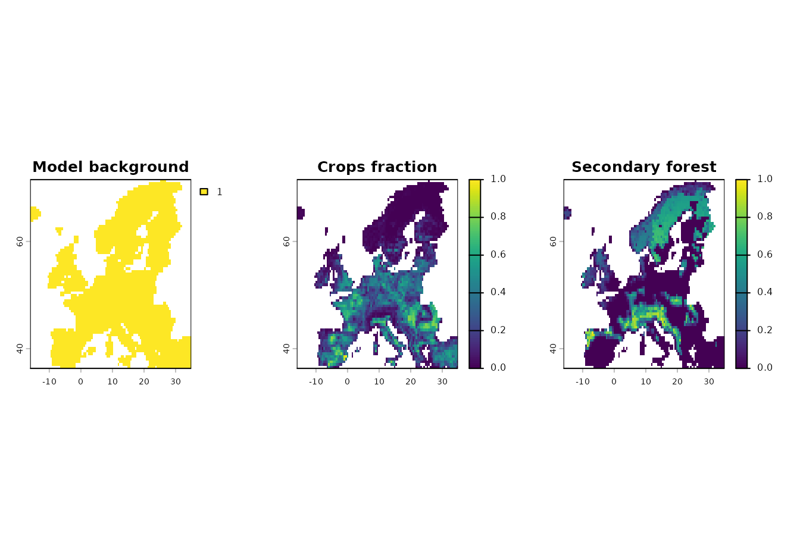
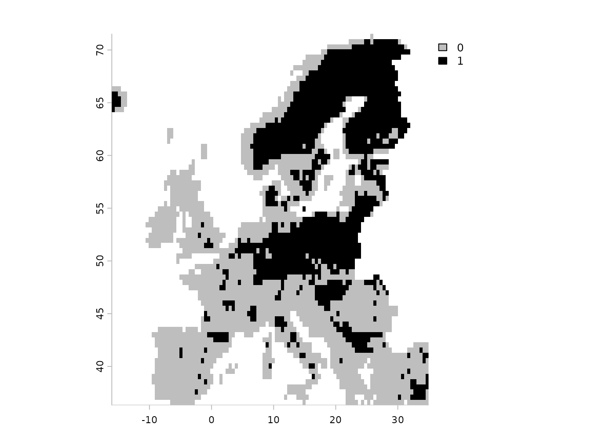
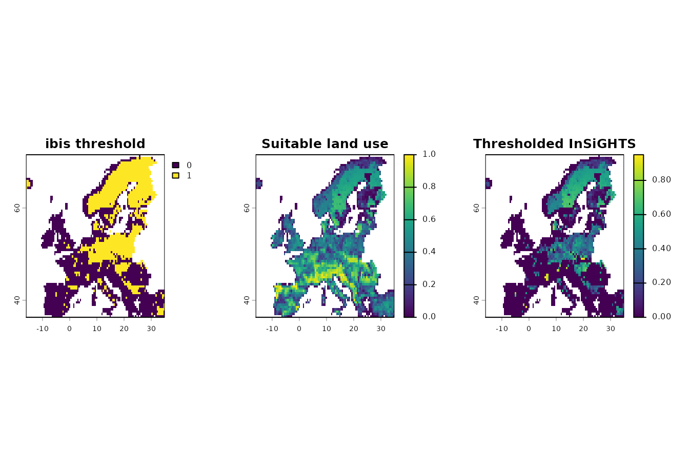
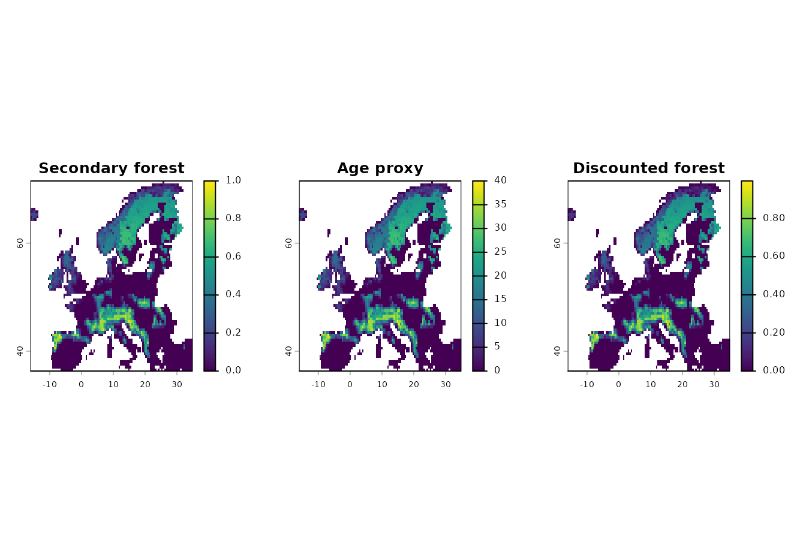
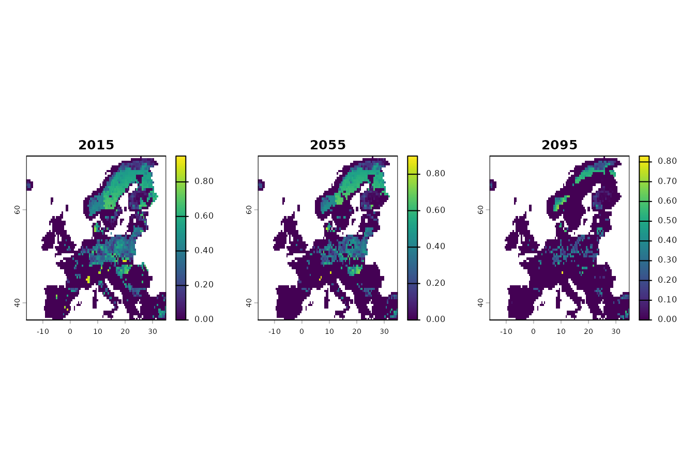
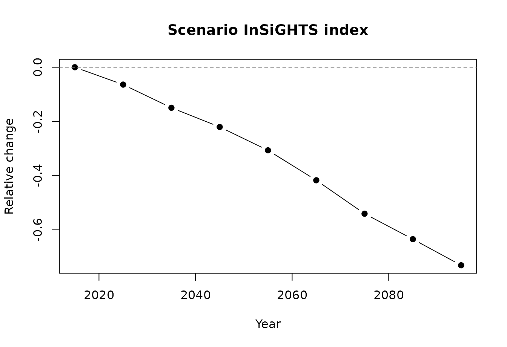

# 2) ibis.iSDM integration

This article shows the direct `ibis.iSDM` integration points in
`ibis.insights`. Direct ibis object support is intentionally limited to
[`insights_fraction()`](https://iiasa.github.io/ibis.insights/reference/insights_fraction.md)
and
[`insights_area()`](https://iiasa.github.io/ibis.insights/reference/insights_area.md),
where the thresholded distribution or projection layer is used. Other
preparation steps, such as maturity discounting or using a continuous
suitability projection, should operate on `SpatRaster` or `stars`
objects before combining them with ibis outputs.

The examples fit a small `ibis.iSDM` model with the example data
distributed by `ibis.iSDM`, threshold it, project it to a future
predictor cube, and then apply the InSiGHTS methods directly to the
resulting ibis objects.

``` r

library(ibis.insights)
library(ibis.iSDM)
library(terra)
library(stars)
library(sf)
```

## Example Data

The current model is trained from the `ibis.iSDM` Europe grid, virtual
occurrence points, and the first time step of the present-future
predictor stack. Land-use inputs for InSiGHTS are built from the `crops`
and `secdf` predictor layers.

``` r

background <- terra::rast(system.file(
  "extdata/europegrid_50km.tif",
  package = "ibis.iSDM",
  mustWork = TRUE
))

sea <- terra::deepcopy(background) != 1
sea[is.na(sea)] <- 1
sea <- terra::as.int(sea)

virtual_range <- sf::st_read(
  system.file("extdata/input_data.gpkg", package = "ibis.iSDM", mustWork = TRUE),
  "range",
  quiet = TRUE
)
virtual_points <- sf::st_read(
  system.file("extdata/input_data.gpkg", package = "ibis.iSDM", mustWork = TRUE),
  "points",
  quiet = TRUE
)

predictor_files <- list.files(
  system.file("extdata/predictors_presfuture/", package = "ibis.iSDM",
              mustWork = TRUE),
  full.names = TRUE
)

suppressWarnings(
  pred_future <- stars::read_stars(predictor_files) |>
    stars:::slice.stars("Time", seq(1, 86, by = 10))
)
sf::st_crs(pred_future) <- sf::st_crs(4326)

pred_current <- ibis.iSDM:::stars_to_raster(pred_future, 1)[[1]]
names(pred_current) <- names(pred_future)

land_use_current <- pred_current[[c("crops", "secdf")]]
land_use_current <- ibis.iSDM::predictor_transform(
  land_use_current,
  option = "norm"
) |>
  round(2)
names(land_use_current) <- c("crops", "secondary_forest")
```

``` r

op <- par(mfrow = c(1, 3), mar = c(2, 2, 3, 4))
plot(background, main = "Model background")
plot(land_use_current[["crops"]], main = "Crops fraction")
plot(land_use_current[["secondary_forest"]], main = "Secondary forest")
```



``` r

par(op)
```

## Fit And Threshold A Distribution

The fitted object is a real `ibis.iSDM` `DistributionModel`. After
thresholding, it can be passed directly to
[`insights_fraction()`](https://iiasa.github.io/ibis.insights/reference/insights_fraction.md)
and
[`insights_area()`](https://iiasa.github.io/ibis.insights/reference/insights_area.md).

``` r

poa <- virtual_points |>
  add_pseudoabsence(field_occurrence = "Observed", template = background)

distribution_model <- distribution(background) |>
  add_biodiversity_poipa(
    poa,
    field_occurrence = "Observed",
    name = "Virtual points"
  ) |>
  add_predictors(
    pred_current,
    transform = "none",
    derivates = "none"
  ) |>
  engine_glm()

modf <- train(
  distribution_model,
  runname = "Null",
  only_linear = FALSE,
  filter_predictors = "none",
  inference_only = FALSE,
  verbose = FALSE
)
modf <- threshold(modf, method = "perc", value = 0.3)

modf$show_rasters()
#> [1] "prediction"           "threshold_percentile"
```

``` r

modf$plot_threshold()
```



## Direct Distribution Methods

Direct `DistributionModel` calls use the thresholded raster in the ibis
object. The land-use layers are summed and applied as fractional habitat
layers.

``` r

threshold_aoh <- insights_fraction(
  range = modf,
  lu = land_use_current,
  clamp = TRUE
)

insights_summary(threshold_aoh, relative = FALSE)
#>   time suitability unit
#> 1   NA    842020.7  km2
```

``` r

threshold_layer <- modf$get_data("threshold_percentile")
if (terra::nlyr(threshold_layer) > 1) {
  threshold_layer <- threshold_layer[[grep("mean", names(threshold_layer))[1]]]
}
summed_land_use <- terra::app(land_use_current, "sum", na.rm = TRUE)
summed_land_use <- st_clamp(summed_land_use, lb = 0, ub = 1)

op <- par(mfrow = c(1, 3), mar = c(2, 2, 3, 4))
plot(threshold_layer, main = "ibis threshold")
plot(summed_land_use, main = "Suitable land use")
plot(threshold_aoh, main = "Thresholded InSiGHTS")
```



``` r

par(op)
```

Area-valued land-use layers work the same way with
[`insights_area()`](https://iiasa.github.io/ibis.insights/reference/insights_area.md).

``` r

land_use_area <- land_use_current * terra::cellSize(
  land_use_current[[1]],
  unit = "km"
)

threshold_area <- insights_area(
  range = modf,
  lu = land_use_area
)

insights_summary(threshold_area, toArea = FALSE, relative = FALSE)
#>   time suitability  unit
#> 1   NA    842020.7 input
```

## Prepared Inputs First

Maturity discounting is a raster operation. Apply it to the land-use
layer first, then combine the prepared layer with the ibis object.

``` r

forest_age <- land_use_current[["secondary_forest"]] * 40
names(forest_age) <- "secondary_forest_age_years"

invisible(utils::capture.output({
  discounted_forest <- insights_discount(
    lu = land_use_current[["secondary_forest"]],
    age = forest_age,
    target_age = 20,
    target = 0.95
  )
}))
names(discounted_forest) <- "discounted_secondary_forest"

discounted_land_use <- c(land_use_current[["crops"]], discounted_forest)
names(discounted_land_use) <- c("crops", "discounted_secondary_forest")

discounted_aoh <- insights_fraction(
  range = modf,
  lu = discounted_land_use,
  clamp = TRUE
)

rbind(
  no_discount = insights_summary(threshold_aoh, relative = FALSE),
  discounted = insights_summary(discounted_aoh, relative = FALSE)
)
#>             time suitability unit
#> no_discount   NA    842020.7  km2
#> discounted    NA    811157.7  km2
```

``` r

op <- par(mfrow = c(1, 3), mar = c(2, 2, 3, 4))
plot(land_use_current[["secondary_forest"]], main = "Secondary forest")
plot(forest_age, main = "Age proxy")
plot(discounted_forest, main = "Discounted forest")
```



``` r

par(op)
```

## Project A Scenario

The scenario projection is a real `ibis.iSDM` `BiodiversityScenario`. It
is thresholded before projection so the direct InSiGHTS methods can use
the projected `threshold` layer.

``` r

mod <- scenario(modf, reuse_limits = FALSE, copy_model = TRUE) |>
  add_predictors(
    env = pred_future,
    transform = "none",
    derivates = "none"
  ) |>
  threshold() |>
  project()

names(mod$get_data())
#> [1] "suitability" "threshold"
```

For scenario objects, temporal land-use or condition layers with
different time steps are aligned to the scenario with
[`align_temporal()`](https://iiasa.github.io/ibis.insights/reference/align_temporal.md).
Here the land-use input keeps only the first and final time steps, while
the scenario projection contains all projected time steps.

``` r

land_use_future <- pred_future |>
  stars:::select.stars(crops, secdf) |>
  stars:::slice.stars("Time", c(1, 9))
land_use_future <- ibis.iSDM::predictor_transform(
  land_use_future,
  option = "norm"
) |>
  round(2)
#> [Setup] 2026-06-12 17:27:15.778832 | When transforming future variables, ensure that unit ranges are comparable (parameter state)!
names(land_use_future) <- c("crops", "secondary_forest")

stars::st_get_dimension_values(land_use_future, "Time")
#> NULL
```

``` r

scenario_aoh <- insights_fraction(
  range = mod,
  lu = land_use_future,
  clamp = TRUE
)

scenario_summary <- insights_summary(
  scenario_aoh,
  relative = TRUE,
  symmetric = TRUE
)
scenario_summary
#>         time       band suitability unit relative_change relative_change_sym
#> 1 2015-01-01 2015-01-01        0.00  km2      0.00000000          0.00000000
#> 2 2025-01-01 2025-01-01   -53922.03  km2     -0.06403884         -0.03307858
#> 3 2035-01-01 2035-01-01  -125891.75  km2     -0.14951146         -0.08079567
#> 4 2045-01-01 2045-01-01  -185600.37  km2     -0.22042256         -0.12386230
#> 5 2055-01-01 2055-01-01  -258136.68  km2     -0.30656808         -0.18103360
#> 6 2065-01-01 2065-01-01  -351191.69  km2     -0.41708199         -0.26348932
#> 7 2075-01-01 2075-01-01  -455024.35  km2     -0.54039566         -0.37023435
#> 8 2085-01-01 2085-01-01  -534150.31  km2     -0.63436717         -0.46452250
#> 9 2095-01-01 2095-01-01  -615340.75  km2     -0.73079050         -0.57578398
```

``` r

scenario_aoh_raster <- terra::rast(scenario_aoh)
scenario_times <- stars::st_get_dimension_values(scenario_aoh, "time")

op <- par(mfrow = c(1, 3), mar = c(2, 2, 3, 4))
plot(scenario_aoh_raster[[1]], main = format(scenario_times[1], "%Y"))
plot(scenario_aoh_raster[[5]], main = format(scenario_times[5], "%Y"))
plot(scenario_aoh_raster[[9]], main = format(scenario_times[9], "%Y"))
```



``` r

par(op)
```

``` r

plot(
  as.Date(scenario_summary$time),
  scenario_summary$relative_change,
  type = "b",
  pch = 19,
  xlab = "Year",
  ylab = "Relative change",
  main = "Scenario InSiGHTS index"
)
abline(h = 0, lty = 2, col = "grey50")
```



## Continuous Suitability

Continuous suitability is not a special ibis dispatch mode in
`ibis.insights`. Extract it from the `ibis.iSDM` object and pass the
resulting `SpatRaster` or `stars` object to the normal raster methods.

``` r

scenario_layers <- mod$get_data()
suitability_name <- setdiff(names(scenario_layers), "threshold")[1]
suitability_projection <- scenario_layers[suitability_name]
names(suitability_projection) <- "suitability"

suitability_aoh <- insights_fraction(
  range = suitability_projection,
  lu = land_use_future,
  clamp = TRUE
)

insights_summary(suitability_aoh, relative = TRUE)
#>         time       band suitability unit relative_change
#> 1 2015-01-01 2015-01-01        0.00  km2      0.00000000
#> 2 2025-01-01 2025-01-01   -26412.91  km2     -0.02409323
#> 3 2035-01-01 2035-01-01   -59455.48  km2     -0.05423389
#> 4 2045-01-01 2045-01-01   -96997.94  km2     -0.08847923
#> 5 2055-01-01 2055-01-01  -141190.15  km2     -0.12879032
#> 6 2065-01-01 2065-01-01  -187187.09  km2     -0.17074764
#> 7 2075-01-01 2075-01-01  -230156.64  km2     -0.20994346
#> 8 2085-01-01 2085-01-01  -273804.68  km2     -0.24975816
#> 9 2095-01-01 2095-01-01  -311189.54  km2     -0.28385976
```

Use the thresholded workflow when a binary area of habitat is required,
and use an extracted suitability workflow when the climatic suitability
value should remain part of the final index.
