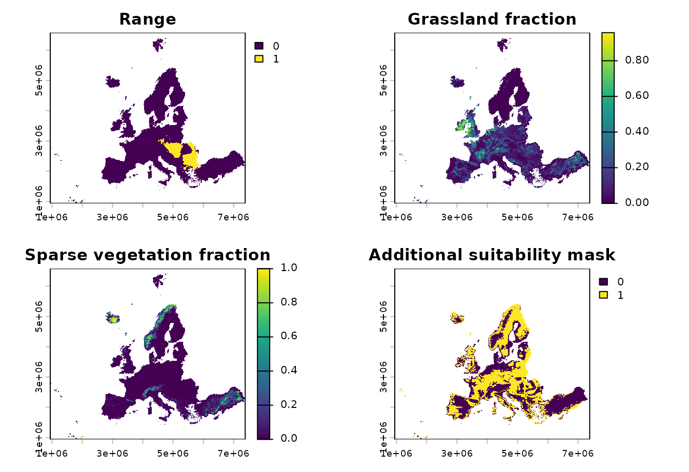
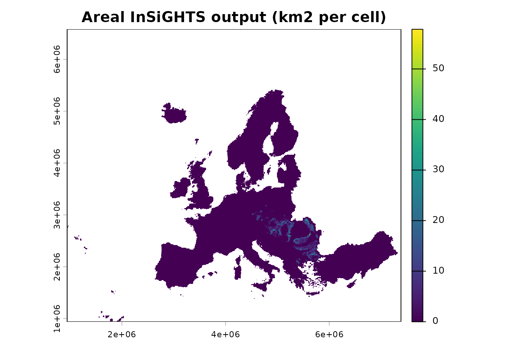
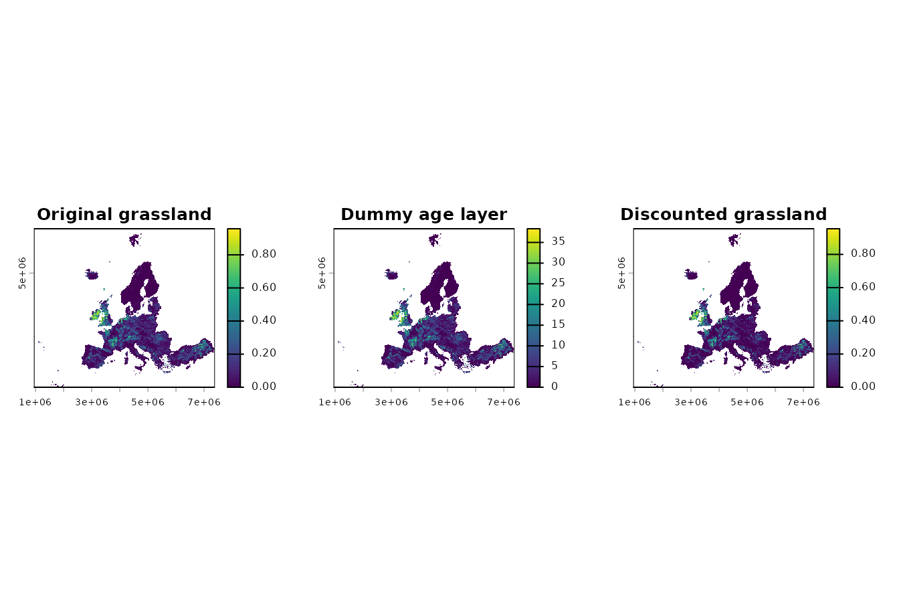
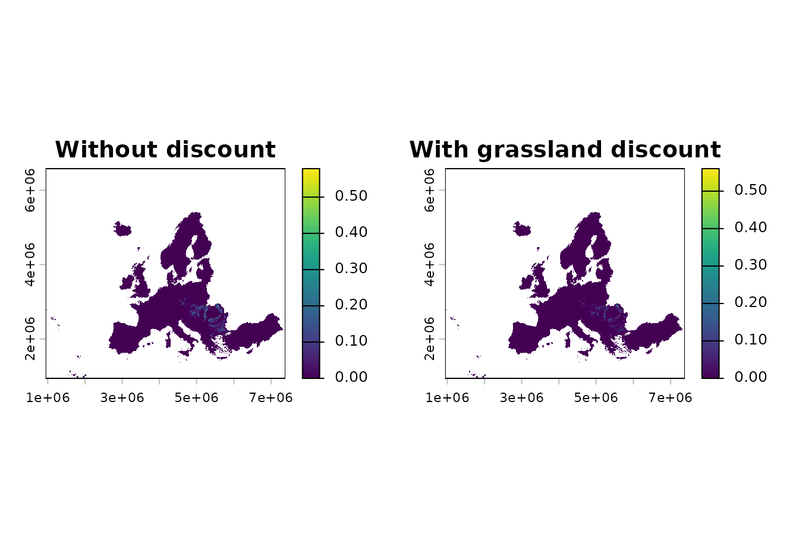
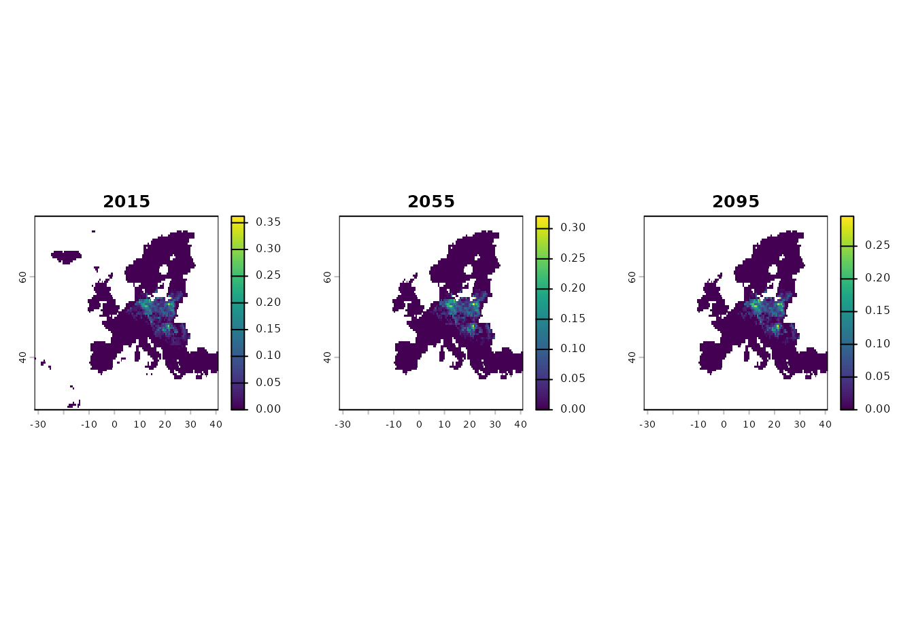

# 1) General InSiGHTS functions

This article gives a first tour of the main `insights_*()` functions.
The examples use the small rasters shipped with the package so they can
be rendered by pkgdown without external downloads.

| Function | Use it when | Main output |
|----|----|----|
| [`insights_fraction()`](https://iiasa.github.io/ibis.insights/reference/insights_fraction.md) | Land-use, habitat, or condition layers are fractions or suitability weights in `[0, 1]`. | A refined suitability or area-of-habitat raster. |
| [`insights_area()`](https://iiasa.github.io/ibis.insights/reference/insights_area.md) | Land-use or habitat layers are already expressed as area per cell. | A refined raster already in area units. |
| [`insights_discount()`](https://iiasa.github.io/ibis.insights/reference/insights_discount.md) | A habitat class should be discounted by an age or maturity layer. | A maturity-weighted version of the land-use layer. |
| [`insights_summary()`](https://iiasa.github.io/ibis.insights/reference/insights_summary.md) | Refined rasters need to be converted to totals or relative indicators. | A data frame of absolute area, relative change, or symmetric relative change. |

``` r

library(ibis.insights)
library(terra)
library(stars)
```

## Example inputs

The current range example is a binary range layer. The land-use layers
are stored as integer fractions from 0 to 10000, so we divide them by
10000 before passing them to
[`insights_fraction()`](https://iiasa.github.io/ibis.insights/reference/insights_fraction.md).
The DEM example is already scaled to `[0, 1]` and is used here as a
simple additional suitability mask.

``` r

range <- terra::rast(system.file(
  "extdata/example_range.tif",
  package = "ibis.insights",
  mustWork = TRUE
))

grassland <- terra::rast(system.file(
  "extdata/Grassland.tif",
  package = "ibis.insights",
  mustWork = TRUE
)) / 10000

sparse_vegetation <- terra::rast(system.file(
  "extdata/Sparsely.vegetated.areas.tif",
  package = "ibis.insights",
  mustWork = TRUE
)) / 10000

lu_fraction <- c(grassland, sparse_vegetation)
names(lu_fraction) <- c("grassland", "sparse_vegetation")

extra_suitability <- terra::rast(system.file(
  "extdata/DEM.tif",
  package = "ibis.insights",
  mustWork = TRUE
))
names(extra_suitability) <- "extra_suitability"
```

``` r

op <- par(mfrow = c(2, 2), mar = c(2, 2, 3, 4))
plot(range, main = "Range")
plot(lu_fraction[[1]], main = "Grassland fraction")
plot(lu_fraction[[2]], main = "Sparse vegetation fraction")
plot(extra_suitability, main = "Additional suitability mask")
```



``` r

par(op)
```

## Fractional land-use: `insights_fraction()`

Use
[`insights_fraction()`](https://iiasa.github.io/ibis.insights/reference/insights_fraction.md)
when the habitat or land-use input is a fraction, probability, or
suitability weight. Multiple land-use layers are summed before they are
applied to the range. `clamp = TRUE` caps the combined suitability at
one when several suitable land-use classes overlap.

``` r

aoh_fraction <- insights_fraction(
  range = range,
  lu = lu_fraction,
  other = extra_suitability,
  clamp = TRUE
)
```

``` r

plot(aoh_fraction, main = "Fractional InSiGHTS output")
```


[`insights_summary()`](https://iiasa.github.io/ibis.insights/reference/insights_summary.md)
converts this fractional raster to area by multiplying by cell area,
because `toArea = TRUE` by default.

``` r

insights_summary(aoh_fraction, relative = FALSE)
#>   time suitability unit
#> 1   NA    23590.72  km2
```

## Areal land-use: `insights_area()`

Use
[`insights_area()`](https://iiasa.github.io/ibis.insights/reference/insights_area.md)
when the land-use values are already in area units. In this example we
convert the fractional land-use layers to square kilometres per cell
with
[`terra::cellSize()`](https://rspatial.github.io/terra/reference/cellSize.html).
Because the output is already in area units, summarize with
`toArea = FALSE`.

``` r

cell_area_km2 <- terra::cellSize(lu_fraction[[1]], unit = "km")
lu_area_km2 <- lu_fraction * cell_area_km2

aoh_area <- insights_area(
  range = range,
  lu = lu_area_km2,
  other = extra_suitability
)
```

``` r

plot(aoh_area, main = "Areal InSiGHTS output (km2 per cell)")
```



``` r

insights_summary(aoh_area, toArea = FALSE, relative = FALSE)
#>   time suitability  unit
#> 1   NA    23590.72 input
```

## Maturity weighting: `insights_discount()`

Use
[`insights_discount()`](https://iiasa.github.io/ibis.insights/reference/insights_discount.md)
before
[`insights_fraction()`](https://iiasa.github.io/ibis.insights/reference/insights_fraction.md)
or
[`insights_area()`](https://iiasa.github.io/ibis.insights/reference/insights_area.md)
when a habitat class should not count at full value immediately after it
appears. The example below creates a simple dummy age layer for
grassland. Real analyses should use an age or maturity layer for the
same habitat class.

``` r

grassland_age <- lu_fraction[["grassland"]] * 40
names(grassland_age) <- "grassland_age_years"

invisible(utils::capture.output({
  grassland_discounted <- insights_discount(
    lu = lu_fraction[["grassland"]],
    age = grassland_age,
    target_age = 20,
    target = 0.95
  )
}))
names(grassland_discounted) <- "grassland_discounted"

lu_discounted <- c(grassland_discounted, lu_fraction[["sparse_vegetation"]])
names(lu_discounted) <- c("grassland_discounted", "sparse_vegetation")

aoh_discounted <- insights_fraction(
  range = range,
  lu = lu_discounted,
  other = extra_suitability,
  clamp = TRUE
)
```

``` r

op <- par(mfrow = c(1, 3), mar = c(2, 2, 3, 4))
plot(lu_fraction[["grassland"]], main = "Original grassland")
plot(grassland_age, main = "Dummy age layer")
plot(grassland_discounted, main = "Discounted grassland")
```



``` r

par(op)
```

``` r

op <- par(mfrow = c(1, 2), mar = c(2, 2, 3, 4))
plot(aoh_fraction, main = "Without discount")
plot(aoh_discounted, main = "With grassland discount")
```



``` r

par(op)
```

``` r

insights_summary(aoh_discounted, relative = FALSE)
#>   time suitability unit
#> 1   NA     11646.5  km2
```

## Indicators: `insights_summary()`

With a single-layer raster,
[`insights_summary()`](https://iiasa.github.io/ibis.insights/reference/insights_summary.md)
reports an absolute total. With multiple layers or time steps, it can
also report change relative to the first time step. The standard
relative change and symmetric relative change are both returned as
fractions; the symmetric relative change is bounded in `[-1, 1]`.

``` r

aoh_series <- c(aoh_fraction, aoh_discounted, aoh_discounted * 0.8)
names(aoh_series) <- c("baseline", "maturity_discount", "future_example")
terra::time(aoh_series, tstep = "years") <- c(2020, 2040, 2060)

index_summary <- insights_summary(
  aoh_series,
  relative = TRUE,
  symmetric = TRUE
)
index_summary
#>   time suitability unit relative_change relative_change_sym
#> 1 2020        0.00  km2       0.0000000           0.0000000
#> 2 2040   -11944.22  km2      -0.5063101          -0.3389660
#> 3 2060   -14273.52  km2      -0.6050481          -0.4337412
```

``` r

plot(
  index_summary$time,
  index_summary$relative_change,
  type = "b",
  pch = 19,
  xlab = "Year",
  ylab = "Relative change",
  main = "InSiGHTS index relative to 2020"
)
abline(h = 0, lty = 2, col = "grey50")
```


## Temporal scenario example

The package also ships a small temporal scenario for *Bombina bombina*.
This is a `stars` object with a time dimension and an
`ensemble_threshold` attribute. It is useful for demonstrating how the
`insights_*()` functions handle temporal range inputs.

``` r

bombina_range <- stars::read_mdim(system.file(
  "extdata/Bombina_bombina__ssp126.nc",
  package = "ibis.insights",
  mustWork = TRUE
))
bombina_range <- split(bombina_range)
bombina_range <- bombina_range["ensemble_threshold"]
```

``` r

invisible(utils::capture.output({
  bombina_aoh <- suppressMessages(insights_fraction(
    range = bombina_range,
    lu = lu_fraction,
    clamp = TRUE
  ))
}))

bombina_summary <- insights_summary(
  bombina_aoh,
  relative = TRUE,
  symmetric = TRUE
)
bombina_summary
#>         time       band suitability unit relative_change relative_change_sym
#> 1 2015-01-01 2015-01-01       0.000  km2      0.00000000          0.00000000
#> 2 2025-01-01 2025-01-01   -1760.229  km2     -0.02073683         -0.01047704
#> 3 2035-01-01 2035-01-01   -9637.467  km2     -0.11353665         -0.06018492
#> 4 2045-01-01 2045-01-01   -7887.350  km2     -0.09291895         -0.04872312
#> 5 2055-01-01 2055-01-01   -9587.168  km2     -0.11294409         -0.05985201
#> 6 2065-01-01 2065-01-01  -13247.307  km2     -0.15606329         -0.08463593
#> 7 2075-01-01 2075-01-01  -12746.687  km2     -0.15016560         -0.08117786
#> 8 2085-01-01 2085-01-01  -15312.780  km2     -0.18039612         -0.09914033
#> 9 2095-01-01 2095-01-01  -16806.513  km2     -0.19799342         -0.10987386
```

``` r

bombina_aoh_raster <- terra::rast(bombina_aoh)
terra::time(bombina_aoh_raster) <- stars::st_get_dimension_values(
  bombina_aoh,
  "time"
)

op <- par(mfrow = c(1, 3), mar = c(2, 2, 3, 4))
plot(bombina_aoh_raster[[1]], main = "2015")
plot(bombina_aoh_raster[[5]], main = "2055")
plot(bombina_aoh_raster[[9]], main = "2095")
```



``` r

par(op)
```

``` r

plot(
  as.Date(bombina_summary$time),
  bombina_summary$relative_change,
  type = "b",
  pch = 19,
  xlab = "Year",
  ylab = "Relative change",
  main = "Temporal InSiGHTS index"
)
abline(h = 0, lty = 2, col = "grey50")
```


